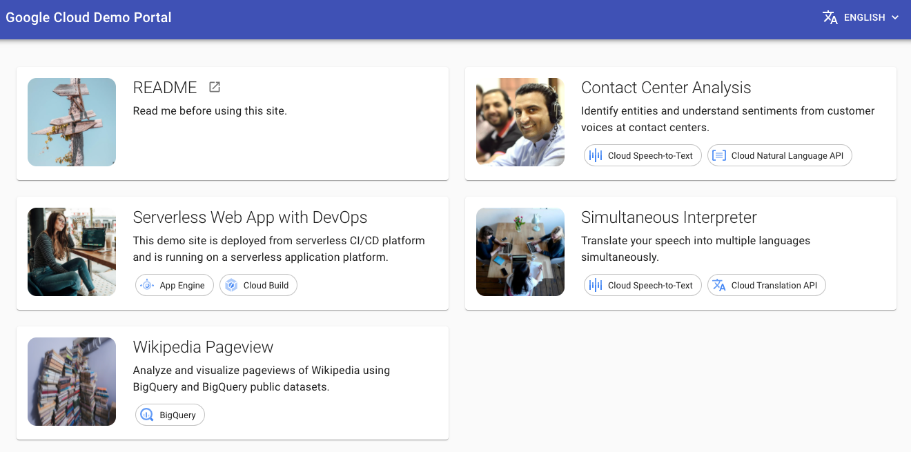

# Cloud Demo Portal

Cloud Demo Portal is an App Engine web application which has small demos.

**Cloud Demo Portal is not an official Google Cloud project.**



## Prerequisites

- An empty Google Cloud project
- [Google Cloud SDK (gcloud)](https://cloud.google.com/sdk/docs/install)

### **NOTE:** Make sure you have a newer version of NodeJS (14.18.0) or newer (in Cloud Shell you can run `nvm install --lts`)

### **NOTE:** Make sure you have a WSL installed (`wsl.exe`) to start bash command

### Clone this repository

```bash
git clone https://github.com/GoogleCloudPlatform/appengine-cloud-demo-portal.git
cd appengine-cloud-demo-portal
```

## Architecture

This project is componed of a web application and a server application.

- The Web-application is responsible of the user interface and serve static assets
- The server to properly handle request with google services, do custom job like storing data in database...

## Run project

First thing we should always do is verify that our app is working on a local env (your own PC !)

```bash
cd web
npm i
npm run start
```

You should be able te see the web portal on the following url :
`http://localhost:3000`

## Deployment

### Login

First you will need to interact with the google platforme, in order to do that you need to log in :

```bash
gcloud auth login --project gil-save-your-business-app
```

### Web-app

Before deploying we need to package our web portal. You can do this with

```bash
npm run build
```

When it's done we will be able to deploy our fresh new package with this command :

```
gcloud app deploy
```

Find the URL of the app to visualize it.

### API

You tought you were done ? Not yet ! If you go to the `Simultaneous Interpreter` you should see that nothing is loading.

It's normal ! It's just an empty shell, we need to put data in it, that's why we need our API's.

First we need to build them :

```bash
docker run --rm -v "$PWD":/usr/src/myapp -w /usr/src/myapp golang:1.19 go build -v
```

Again we are ready to deploy :

```bash
gcloud app deploy
```

Congrats ! You deployed your backend to the cloud.

### Why is it still not working ?

It's time to shine ! Find out why it's not working and how we can solve it. The objective is to fix the issue on the `Simultaneous Interpreter` page.

```bash
gcloud app deploy dispatch.yaml
```
